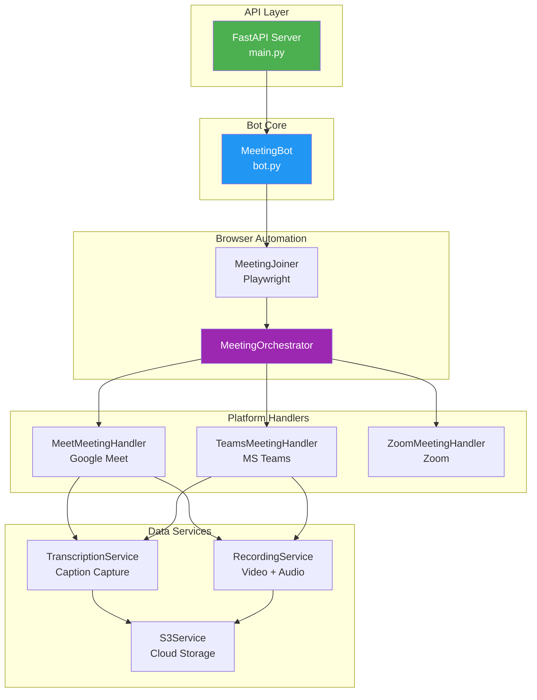
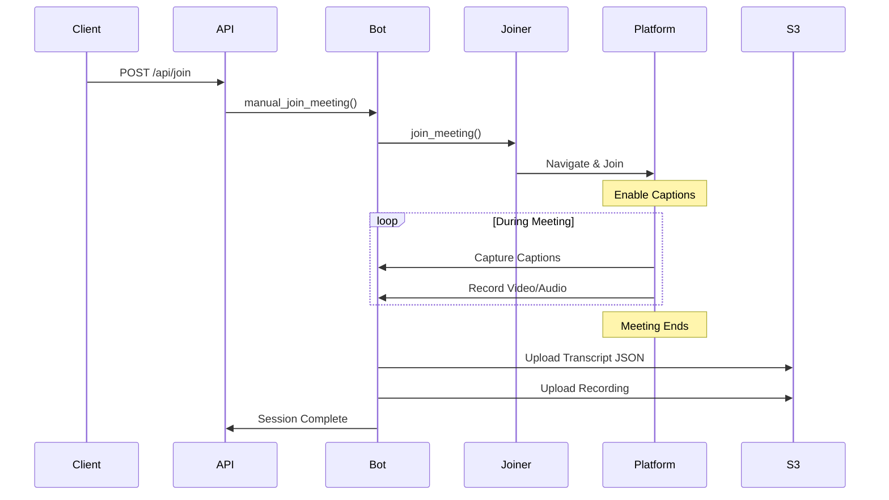

# 🎯 Meeting Bot

An intelligent meeting automation bot powered by **FastAPI** and **Playwright**. Joins Google Meet, Microsoft Teams, and Zoom meetings to capture transcripts and recordings.

---

## ✨ Features

- 🚀 **Simple REST API** - Single endpoint to join any meeting
- 🎥 **Multi-Platform** - Google Meet, Microsoft Teams, Zoom
- 🗣️ **Live Transcription** - Captures meeting captions in real-time
- 🌍 **89 Languages** - Full language support for Google Meet
- 📹 **Auto Recording** - Video + synchronized audio recording
- ☁️ **S3 Integration** - Optional cloud storage for transcripts & recordings

---

## 🏗️ System Architecture



---

## 🔄 Meeting Join Flow



---

## 📥 Installation

### Local Development

```bash
# Clone the repository
git clone <repository-url>
cd meeeting-transcription-bot

# Create virtual environment
python -m venv venv
source venv/bin/activate  # Windows: venv\Scripts\activate

# Install dependencies
pip install -r requirements.txt

# Install Playwright browsers
playwright install chromium

# Run the application
python main.py
```

### Docker

```bash
docker-compose up --build -d
```

---

## 🚀 API Reference

### Endpoints

| Endpoint | Method | Description |
|----------|--------|-------------|
| `/` | GET | Health check |
| `/api/status` | GET | Bot status |
| `/api/join` | POST | **Join a meeting** |
| `/api/sessions` | GET | Active sessions |

### Join Meeting Request

```bash
curl -X POST "http://localhost:8888/api/join" \
  -H "Content-Type: application/json" \
  -d '{
    "bot_name": "Meeting Bot",
    "meeting_url": "https://meet.google.com/abc-defg-hij",
    "caption_language": "English"
  }'
```

### Request Parameters

| Parameter | Type | Required | Default | Description |
|-----------|------|----------|---------|-------------|
| `bot_name` | string | ✅ | - | Display name in meeting |
| `meeting_url` | string | ✅ | - | Meeting URL |
| `caption_language` | string | ❌ | `English` | Transcription language |
| `s3_bucket_name` | string | ❌ | - | S3 bucket for storage |
| `aws_access_key_id` | string | ❌ | - | AWS access key |
| `aws_secret_access_key` | string | ❌ | - | AWS secret key |
| `aws_region` | string | ❌ | `us-east-1` | AWS region |

### Response

```json
{
  "success": true,
  "meeting_id": "manual_a1b2c3d4e5f6",
  "session_id": "1234567890abcdef",
  "platform": "google_meet"
}
```

---

## 🌍 Language Support

### Google Meet (89 Languages)

Google Meet supports full language selection. Pass any of these values in `caption_language`:

| Language | Value |
|----------|-------|
| English | `English` |
| English (UK) | `English (UK)` |
| Spanish (Spain) | `Spanish (Spain)` |
| Spanish (Mexico) | `Spanish (Mexico)` |
| French | `French` |
| French (Canada) | `French (Canada)` |
| German | `German` |
| Italian | `Italian` |
| Portuguese (Brazil) | `Portuguese (Brazil)` |
| Chinese Mandarin | `Chinese, Mandarin (Simplified)` |
| Japanese | `Japanese` |
| Korean | `Korean` |
| Arabic (UAE) | `Arabic (United Arab Emirates)` |
| Hindi | `Hindi` |
| Russian | `Russian` |

<details>
<summary><b>View All 89 Languages</b></summary>

```
Afrikaans (South Africa), Albanian (Albania), Amharic (Ethiopia),
Arabic (Egypt), Arabic (Levant), Arabic (Maghrebi), Arabic (Peninsular Gulf),
Arabic (United Arab Emirates), Armenian (Armenia), Azerbaijani (Azerbaijan),
Basque (Spain), Bengali (Bangladesh), Bulgarian (Bulgaria), Burmese (Myanmar),
Catalan (Spain), Chinese, Cantonese (Traditional), Chinese, Mandarin (Simplified),
Chinese, Mandarin (Traditional), Czech (Czech Republic), Dutch, English,
English (UK), English (Australia), English (India), English (Philippines),
Estonian (Estonia), Filipino (Philippines), Finnish (Finland), French,
French (Canada), Galician (Spain), Georgian (Georgia), German, Greek (Greece),
Gujarati (India), Hebrew (Israel), Hindi, Hungarian (Hungary), Icelandic (Iceland),
Indonesian (Indonesia), Italian, Japanese, Javanese (Indonesia), Kannada (India),
Kazakh (Kazakhstan), Khmer (Cambodia), Kinyarwanda (Rwanda), Korean, Lao (Laos),
Latvian (Latvia), Lithuanian (Lithuania), Macedonian (North Macedonia),
Malay (Malaysia), Malayalam (India), Marathi (India), Mongolian (Mongolia),
Nepali (Nepal), Northern Sotho (South Africa), Norwegian (Norway), Persian (Iran),
Polish (Poland), Portuguese (Brazil), Portuguese (Portugal), Romanian (Romania),
Russian, Serbian (Serbia), Sesotho (South Africa), Sinhala (Sri Lanka),
Slovak (Slovakia), Slovenian (Slovenia), Spanish (Mexico), Spanish (Spain),
Sundanese (Indonesia), Swahili, Swati (South Africa), Swedish (Sweden),
Tamil (India), Telugu (India), Thai (Thailand), Tshivenda (South Africa),
Tswana (South Africa), Turkish (Turkey), Ukrainian (Ukraine), Urdu (Pakistan),
Uzbek (Uzbekistan), Vietnamese (Vietnam), Xhosa (South Africa),
Xitsonga (South Africa), Zulu (South Africa)
```

</details>

### Microsoft Teams

Teams uses the system's default caption language. The `caption_language` parameter is ignored for Teams meetings - captions are enabled automatically in the default language.

### Zoom

Zoom caption support varies by meeting settings. The bot enables captions if available.

---

## 📁 Project Structure

```
meeeting-transcription-bot/
├── main.py                        # FastAPI entry point
├── requirements.txt               # Dependencies
├── Dockerfile
├── docker-compose.yml
│
├── app/
│   ├── bot.py                     # Core bot logic
│   ├── models.py                  # Data models
│   │
│   ├── config/
│   │   ├── settings.py            # Configuration
│   │   └── logger.py              # Logging
│   │
│   ├── meeting_handler/
│   │   ├── playwright_joiner.py   # Browser automation
│   │   ├── meeting_orchestrator.py
│   │   ├── meet_handler.py        # Google Meet
│   │   ├── teams_meeting_handler.py
│   │   └── zoom_meeting_handler.py
│   │
│   ├── transcription/
│   │   └── service.py             # Caption capture
│   │
│   ├── recording/
│   │   └── recording_service.py   # Video/audio
│   │
│   └── storage/
│       ├── s3_service.py          # AWS S3 upload
│       └── meeting_database.py    # Local tracking
│
├── recordings/                     # Local recordings
└── transcripts/                    # Local transcripts
```

---

## ⚙️ Configuration

**No configuration required!** All settings have sensible defaults.

### Optional Environment Variables

| Variable | Default | Description |
|----------|---------|-------------|
| `LOG_LEVEL` | `INFO` | Logging level |
| `BOT_DEFAULT_BOT_NAME` | `Meeting Bot` | Default name |
| `RECORDING_ENABLED` | `true` | Enable recording |

### S3 Storage (Optional)

Pass S3 credentials in the API request, or set environment variables:

```bash
export AWS_ACCESS_KEY_ID=your_key
export AWS_SECRET_ACCESS_KEY=your_secret
export AWS_S3_BUCKET_NAME=your-bucket
export AWS_REGION=us-east-1
```

---

## 📊 Output Format

### Transcript JSON

```json
{
  "metadata": {
    "meeting_id": "manual_abc123",
    "meeting_url": "https://meet.google.com/abc-defg-hij",
    "platform": "google_meet",
    "title": "My Bot",
    "start_time": "2026-01-21T12:00:00",
    "end_time": "2026-01-21T13:00:00",
    "duration_seconds": 3600,
    "participant_names": ["Alice", "Bob"]
  },
  "transcription": [
    {"timestamp": "12:00:15", "speaker": "Alice", "text": "Hello everyone"},
    {"timestamp": "12:00:20", "speaker": "Bob", "text": "Hi Alice!"}
  ],
  "export_timestamp": "2026-01-21T13:00:05"
}
```

### Recording Files

```
recordings/{meeting_id}/
├── video_audio.webm    # Video with synchronized audio
├── audio_only.opus     # Audio-only (for transcription)
└── metadata.json       # Recording metadata
```

---

## 🛠️ Requirements

- Python 3.10+
- Playwright with Chromium
- ffmpeg (for audio extraction)

---

## 📄 License

MIT License
